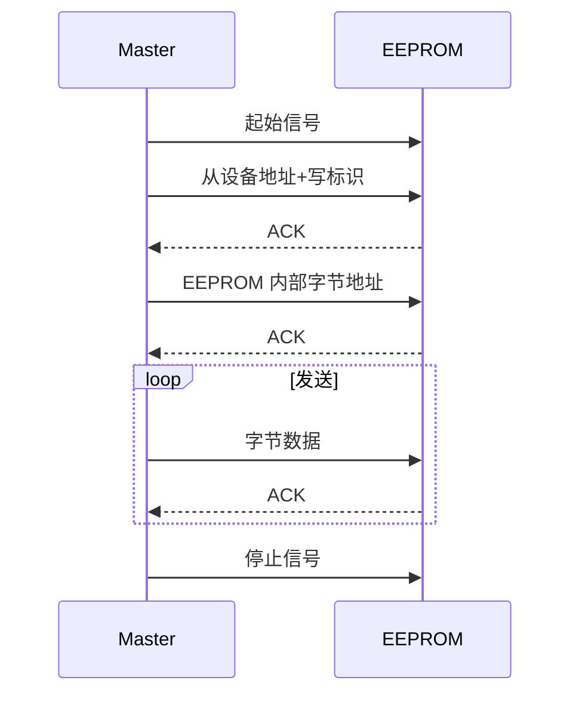
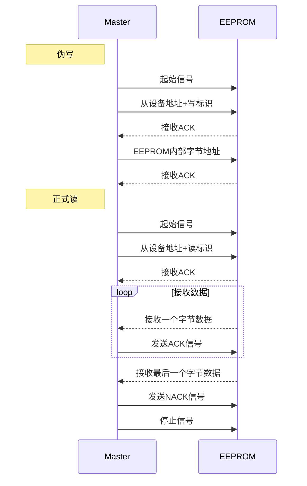

## 第 8 章 I2C 通信

### 8.1 I2C 基础知识

#### ① 概述

I²C，即 Inter-Integrated Circuit，是一种**同步**、**半双工**、**串行**通信协议，采用**主从架构**， **双线制**， 通过**设备地址**实现多从机间的短距离低速通信，

#### ② 物理层


> **SCL：** 串行时钟总线。
>
> **SDA：**串行数据总线。

> 可连接多个 I2C 通讯设备，支持一主多从也支持多主多从。
>
> 每个设备都有唯一的地址，主机通过这个地址与从机通信。
>
> 主设备和从设备使用开漏模式接入总线，靠总线上的上拉电阻输出高电平。

#### ③ 协议层

**起始信号和停止信号：**


> **注意：**空闲状态 SCL 和 SDA 都是高电平。

```
起始位： SCL高电平时候，检测到 SDA 下降沿
结束位： SCL高电平时候，检测到 SDA 上升沿
```

**从机地址和读写标识位：**


> **注意：** I2C 通信高位先行。

```
1. 从机地址可以是7位或10位，实际中7位的地址应用比较广泛。
2. 紧跟设备地址的位(第8位或第11位)是读写标识，“1” 表示主机读从机的数据，“0”表示主机向从机写数据。
```

**数据读写和有效性：**


> **注意：** I2C 通信高位先行。

```
1. 发送方在SCL低电平时修改SDA数据
2. 接收方在SCL高电平时读取SDA数据,此时SDA必须保持稳定（不允许变化），这是I2C数据有效性规则的核心要求。
```

**应答信号：**


```
1. ACK（应答信号）
   在每次字节（8位）传输后，接收端在第9个时钟周期将SDA线拉低，表示已成功接收数据并准备继续传输。
   触发场景：	
   		从机正确接收主机发送的地址或数据后，需返回ACK以确认通信继续。
   		主机在读取数据过程中，若需接收更多字节，需对每个已接收的字节发送ACK。

2. NACK（非应答信号）
   当接收端在第9个时钟周期保持SDA线为高电平时，表示未成功接收数据或要求终止传输。
   触发场景：
   		从机无响应：从机地址错误、设备故障或未准备好时返回NACK。
   		主机主动终止：主机读取完所需数据后，发送NACK通知从机停止发送，随后产生停止信号。
   		总线冲突：在多主机场景中，仲裁失败的主机会检测到NACK并退出总线控制。
```

#### ④ 模式

```
标准模式： 100Kbit/s
快速模式： 400kbit/s
高速模式： 3.4Mbit/s
```

### 8.2 EEPROM（M24C02） 概述

#### ① M24C02 特性

M24C02 是意法半导体（STMicroelectronics）推出的一款基于 **I²C总线** 的串行EEPROM存储器，具有以下特点： 

```
1. 支持I2C的标准模式(100Kbit/s)和快速模式(400kbit/s)
2. 存储容量256字节，分为16个页，每个页分为16字节，每个字节都可以被寻址（8位地址）
3. 页的写周期是 5ms
```

#### ② 设备地址


```
固定1010 + E1、E2、E3三个引脚配置
```

#### ③ 写多个字节数据时序（一页内）



> EEPROM 检测到Stop信号开始写（M24C02的写周期 5ms）

#### ④ 读多个字节数据时序（先伪写再读）



> EEPROM 收到主设备发的 NACK 后会停止发送数据。

### 8.3 案例1：使用IIC协议读写EEPROM - 软件方式实现

#### ① 硬件电路原理图


#### ② 代码实现

**IIC驱动代码:**

```
初始化函数
发送起始信号函数
发送结束信号函数
发送一个字节数据函数
接收应答信号函数
接收一个字节数据函数
发送应答信号函数
```

**EEPROM 部分代码:**

```c
/**
 * @brief 向指定位置写入指定长度的数据
 *
 * @param addr          要写入的位置
 * @param write_datas   要写入的数据
 * @param write_len     要写入的长度
 */
void Int_EEPROM_WriteData(uint8_t addr, uint8_t *write_datas, uint16_t write_len);

/**
 * @brief 从指定位置读取指定长度的数据
 *
 * @param addr          要读取的位置
 * @param read_datas    读取到的数据保存到此处
 * @param read_len      要读取的长度
 */
void Int_EEPROM_ReadData(uint8_t addr, uint8_t *read_datas, uint16_t read_len);
```

### 8.4 STM32 的 I2C 片上外设

#### ① 功能框图


#### ② I2C相关寄存器

| 寄存器名称 | 说明           | 相关控制位/标志位                                            |
| ---------- | -------------- | ------------------------------------------------------------ |
| CR1        | 控制寄存器1    | ACK:  应答使能<br>STOP:  停止信号产生<br>START:  开始信号产生<br>SMBus:  选择I2C模式(0)还是SMBus模式(1)<br>PE:  I2C模块使能 |
| CR2        | 控制寄存器2    | FREQ：I2C时钟频率，置范围2~36                                |
| DR         | 数据寄存器     | 高8位保留，低8位有效                                         |
| SR1        | 状态寄存器1    | TxE:  数据寄存器为空(发送时)<br>RxNE: 数据寄存器非空(接收时)<br>BTF: 字节发送结束<br>ADDR: 地址已发送<br>SB:  起始位已发送 |
| SR2        | 状态寄存器2    | BUSY:  1表示总线忙，0表示总线无数据通信                      |
| CCR        | 时钟控制寄存器 | FS: 选择标准模式(0)或快速模式(1)<br/>CCR: 时钟控制分频系数(主模式) |
| TRISE      | 上升沿寄存器   | TRISE：的最大上升时间 ( 主模式 )                             |

#### ③ 相关引脚

| I2C模块 |        默认引脚         |      重映射引脚       |
| :-----: | :---------------------: | :-------------------: |
|  I2C1   |  PB6（SCL） PB7（SDA）  | PB8（SCL） PB9（SDA） |
|  I2C2   | PB10（SCL） PB11（SDA） |          无           |


### 8.5 案例2：使用IIC协议读写EEPROM - 硬件方式实现

#### ① 寄存器方式实现I2C驱动

初始化流程：

```
1. 对 I2C2、GPIOB 时钟使能
2. 设置 SCL(PB10)、SDA(PB11) 为复用开漏输出
3. I2C2 设置
   3.1 软复位（CR1.SWRST 先置1、延时、再置0、延时）
   3.2 设置输入的时钟频率，APB1的频率 (CR2.FREQ=100100)
   3.3 设置输入时钟分频值，达到100kbit/s (CCR.CCR=180)
   3.4 设置上升沿时间，最大1us (TRISE.TRISE=37)
   3.5 I2C2模块使能 (CR1.PE=1)
```

发送起始信号：

```
1. CR1.START 控制位置 1
2. 等待起始信号发送完成 (SR1.SB 标志位)
```

发送结束信号：

```
1. CR1.STOP 控制位置 1
```

发送从设备地址和读写标识：

```
1. 将从设备地址和读写标识写入 DR
2. 等待发送完成 (SR1.ADDR 标志位)
3. 清除 ADDR 标志位 (读 SR2)
```

发一个字节数据：

```
1. 将数据写入 DR
2. 等待发送完成 (SR1.BTF 标志位)
```

获取接收到的应答信号：

```
1. 读 SR1.AF 标志位
2. 清除 AF 标志位
```

接收一个字节：

```
1. 等待接收到一个字节 (SR1.RXNE 标志位)
2. 读 DR
```

发送应答信号：

```
设置 CR1.ACK 控制位，回复ACK，置1；回复NACK，置0
```

#### ② HAL 库方式实现

**STM32 Cube MX 配置：**


**HAL库中 读写存储器的函数：**

```
HAL_I2C_Mem_Write()
HAL_I2C_Mem_Read()

HAL_I2C_Master_Transmit()
HAL_I2C_Master_Receive()
```


## 附录

### 名词缩写

```
SMBus	System Management Bus(系统管理总线)
```

### I²C 和 SMBus 对比

| **特性**             | **SMBus**                            | **I²C**                                                      |
| -------------------- | ------------------------------------ | ------------------------------------------------------------ |
| **通信速率**         | 10 kbps - 100 kbps                   | 标准模式 100 kbps，快模式 400 kbps，高速模式最高可达 3.4 Mbps |
| **超时机制**         | 从设备响应时间不能超过 35 毫秒       | 无强制超时要求                                               |
| **电源故障保护**     | 支持低功耗和断电情况下的系统状态保护 | 无电源管理机制                                               |
| **报警信号线**       | 支持 SMBALERT#，从设备可以主动报警   | 无报警信号线，通信必须由主设备发起                           |
| **数据包格式和校验** | 更严格的格式和 CRC 校验              | 格式灵活，无强制的 CRC 校验                                  |
| **电压要求**         | 3.0V - 5V                            | 1.8V - 5.5V，适应更多电压范围                                |
| **应用场景**         | 系统管理，如电源、温度、电池状态监控 | 通用设备间通信，如传感器、存储器                             |

 SMBus 是 I²C 协议的一种变种， 专注于可靠性和状态监控，适用于电源管理和设备健康监控；而 I²C 具有较大的灵活性，适合通用的数据传输需求。

### VSCode AI 编程扩展

```
字节：Trae AI
阿里：Lingma
```

